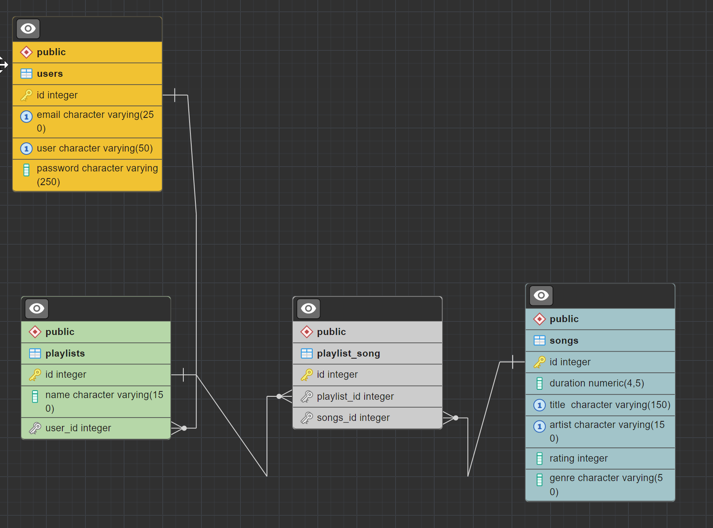

# Conectarse a Neon
## Explicacion sobre **ssl**
```javascript
module.exports = {
  development: {
    client: process.env.DB_DRIVER || 'pg',
    connection: {
      user: process.env.DB_USER,
      password: process.env.DB_PASSWORD,
      host: process.env.DB_HOST,
      port: process.env.DB_PORT,
      database: process.env.DB_NAME,
      ssl: {
        rejectUnauthorized: false,
        // Opcional, si estás utilizando un certificado autofirmado
      },
    },
  },
  // ...
};
```
Se agregar la propiedad _ssl_ dentro del objeto **connection** con **rejectUnauthorized: false**, estás indicando explícitamente que se debe utilizar una conexión SSL sin requerir una autorización explícita del certificado.

En este escenario, el controlador o la biblioteca de PostgreSQL asume que se requiere una conexión SSL y maneja la configuración de SSL internamente **sin necesidad de especificar** _sslmode=require_ explícitamente.


## EDP de la Base de datos



# Migracion
Recuerda que la migración hacia arriba _up_ se ejecuta al __aplicar__ las migraciones con el comando __$ npx knex migrate:latest__

Mientras que la migración hacia abajo _down_ se ejecuta al __revertir__ las migraciones con el comando __$ npx knex migrate:rollback__.


# Creacion de Usuario